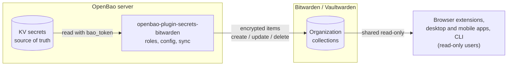
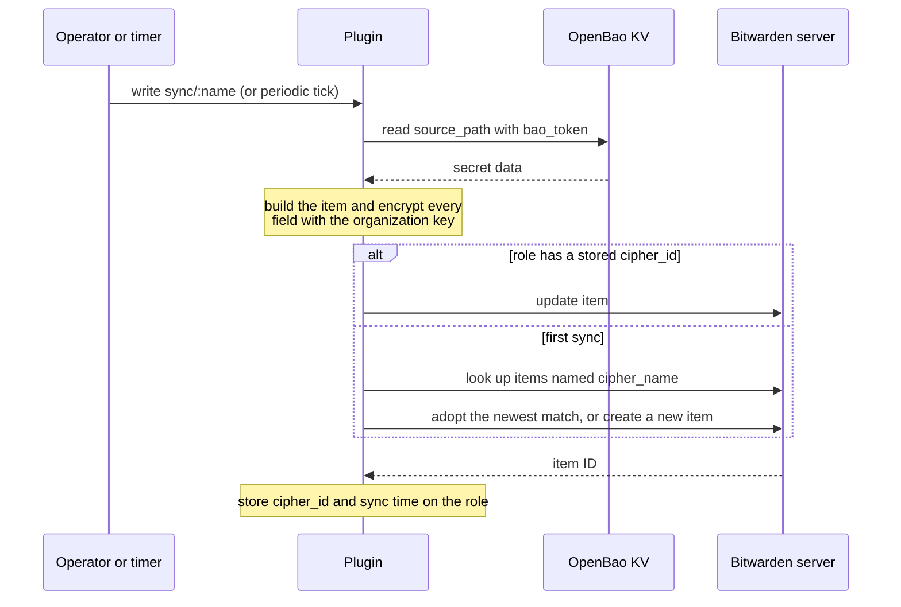
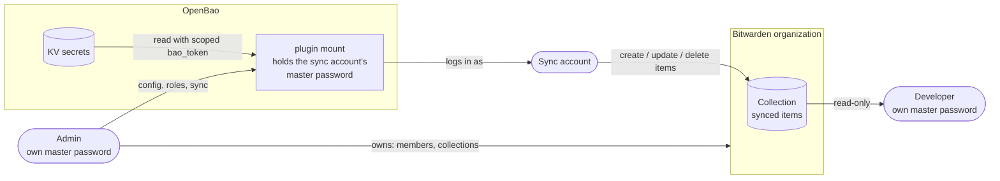

# openbao-plugin-secrets-bitwarden

[](https://github.com/salir-se/openbao-plugin-secrets-bitwarden/actions/workflows/ci.yml)
[](https://github.com/salir-se/openbao-plugin-secrets-bitwarden/releases)
[](LICENSE)

An [OpenBao](https://openbao.org) secrets-engine plugin that pushes secrets
from OpenBao KV into a Bitwarden-compatible vault, one way.

OpenBao stays the source of truth. When a credential is rotated in OpenBao, the
plugin rewrites the matching vault item, so people who read passwords through
Bitwarden apps, browser extensions or the CLI see the current value without
anyone copying it by hand. Nothing is ever read back from Bitwarden into
OpenBao.

## What it is for

The jobs this plugin is built for, and how it does each one:

1. **When a developer needs a credential, I want to share it without sending
   it over chat or giving them access to OpenBao, and rotate it at any moment,
   so that they always have the current value and nothing else.** An Admin
   maps a KV secret to an item in a collection the Developer can only read. A
   new value written to OpenBao reaches the item on the next sync, or at once
   with `bao write -f bitwarden/sync/:name`.
2. **When a credential is rotated by a job, I want the copy people use to
   follow, so that nobody works from a stale password.** Periodic sync
   re-checks every role and pushes only the secrets whose KV data changed.
3. **When people need shared credentials, I want them to use the tools they
   already have, so that I do not issue them OpenBao tokens or policies.**
   They read the items in Bitwarden apps, the browser extension or `bw`, with
   their own account.
4. **When a value exists in two places, I want one of them to win, so that
   there is a single source of truth.** OpenBao is authoritative: an edit made
   in the vault is overwritten by the next sync, and nothing flows back.
5. **When a secret must be withdrawn, I want one action to remove it, so that
   it does not linger in the vault.** Deleting the role deletes the item for
   every member. Who can read a collection is managed in Bitwarden.
6. **When I am asked what is shared with people, I want an inventory.**
   `roles/`, `sync/` and `status` show which secrets are published and when
   each was last synced.

The plugin propagates a rotation; it does not rotate anything itself. Change
the credential at the target system and write the new value to OpenBao. The
old value then disappears from the vault item, but whoever copied it earlier
still has it until the target system stops accepting it.

Not goals: two-way sync, replacing OpenBao dynamic secrets for workloads, and
sharing with people outside the organization.

All six are exercised by the [end-to-end suite](docs/e2e.md), apart from
changing who can read a collection. Team practices built on them are in
[docs/way-of-working.md](docs/way-of-working.md).

## Status and compatibility

- This is an independent, community-maintained external plugin, released from
  its own repository as OpenBao's
  [plugin policy](https://openbao.org/community/policies/plugins/) describes
  for external plugins. It is not affiliated with or endorsed by the OpenBao
  project or Bitwarden Inc. Bitwarden and OpenBao are trademarks of their
  respective owners.
- Pre-1.0. Paths and field names may still change between minor versions.
- The plugin speaks the Bitwarden client API. It is developed and tested
  against [Vaultwarden](https://github.com/dani-garcia/vaultwarden).
- **The official Bitwarden server (cloud or self-hosted) is untested.** One
  known gap: the `status` endpoint probes `<url>/alive`, which is a Vaultwarden
  route.
- The Bitwarden account must use the **PBKDF2-SHA256** KDF. Argon2id is not
  implemented, and login fails with `unsupported KDF type: 1`.
- The plugin logs in with email and master password only. It sends no
  two-factor token, so use an account without two-step login.
- Built against the OpenBao SDK v2 (`github.com/openbao/openbao/sdk/v2`).
- Parts of this repository (at minimum the unit tests, documentation and CI
  configuration) were produced with generative AI assistance under maintainer
  direction. See [CONTRIBUTING.md](CONTRIBUTING.md#ai-assisted-contributions).

## How it works



The flow is one-way: nothing is ever read back from the vault into OpenBao.



1. A **role** maps one KV secret to one vault item: which KV fields become the
   username, password and URI, which collections the item belongs to.
2. A **sync**, either on demand or on a timer, reads the KV secret over the
   OpenBao HTTP API, builds the item, encrypts it and creates or updates it in
   the vault. The item ID is stored on the role so later syncs update in place.
3. With `sync_interval` set, the plugin re-checks every role on that interval
   and pushes only the ones whose KV data changed.

### Client-side encryption

A Bitwarden server stores only ciphertext, so the plugin has to do what a
Bitwarden client does (`crypto.go`):

| Step | Mechanism |
|------|-----------|
| Master key | PBKDF2-SHA256 over the master password, salt = lowercased email, iteration count from the server's prelogin response |
| Stretched keys | HKDF-Expand-SHA256 with info `enc` and `mac`, 32 bytes each |
| Login hash | PBKDF2-SHA256(master key, master password, 1 iteration), base64 |
| User key | 64-byte symmetric key from the login response, decrypted with the stretched keys |
| Organization key | Taken from `/api/sync`; RSA-2048-OAEP-SHA1 (type 4, decrypted with the account's private key) or AES (type 2) |
| Item fields | AES-256-CBC with PKCS#7 padding and HMAC-SHA256 over IV and ciphertext, encoded as `2.<iv>\|<ciphertext>\|<mac>` |

Every item field (name, notes, username, password, URIs, custom field names
and values) is encrypted separately before it leaves OpenBao. Organization
items use the organization key, personal items the user key.

## Prerequisites

The setup below assumes that these are already in place:

- OpenBao is installed, initialized and unsealed, and the `bao` CLI can reach
  it with a token that may manage plugins, mounts and policies.
- A Bitwarden-compatible server (tested with Vaultwarden) is running behind
  `https://`, and the Bitwarden CLI `bw` is configured for it.

Confirm it:

```bash
bao status          # Sealed: false
bao token lookup    # the token you expect, with the policies you expect
bw config server    # prints your server URL, not bitwarden.com
bw status           # "serverUrl" is your server
```

Installing the servers and CLIs and connecting them is covered, with links to
the official documentation, in [docs/prerequisites.md](docs/prerequisites.md).
To try everything on one machine without installing anything but Docker, use
the [end-to-end environment](docs/e2e.md): `mise run e2e-up`.

## Install

### From a release

Releases are built and published by GitHub Actions from version tags. Download
the build for your platform and `checksums.txt` from
[GitHub Releases](https://github.com/salir-se/openbao-plugin-secrets-bitwarden/releases)
(linux and darwin, amd64 and arm64). Each platform is published both as a bare
binary and as a `.tar.gz` archive. The bare binary's checksum is the value
`bao plugin register` needs.

```bash
VERSION=0.1.0
BASE=https://github.com/salir-se/openbao-plugin-secrets-bitwarden/releases/download/v${VERSION}
curl -fLO "${BASE}/openbao-plugin-secrets-bitwarden_${VERSION}_linux_amd64"
curl -fLO "${BASE}/checksums.txt"
sha256sum --ignore-missing -c checksums.txt

# Optional: check it was built by this repository's release workflow
gh attestation verify "openbao-plugin-secrets-bitwarden_${VERSION}_linux_amd64" \
    --repo salir-se/openbao-plugin-secrets-bitwarden

install -m 0755 "openbao-plugin-secrets-bitwarden_${VERSION}_linux_amd64" \
    /etc/openbao/plugins/openbao-plugin-secrets-bitwarden
```

### From an OCI image (declarative install)

OpenBao can download and register plugins declared in the server
configuration. Each release publishes a signed multi-arch image (linux/amd64 and linux/arm64)
at `ghcr.io/salir-se/openbao-plugin-secrets-bitwarden`. The release notes of
each version list the pinned `tag@sha256:...` reference and the `cosign verify`
command.

```hcl
plugin_directory     = "/etc/openbao/plugins"
plugin_auto_download = true

plugin "secret" "bitwarden" {
  image = "ghcr.io/salir-se/openbao-plugin-secrets-bitwarden:v0.1.0@sha256:<image digest>"
}
```

Pin the image by digest, or set `sha256sum` to the plugin binary's SHA-256
when you do not. With `plugin_auto_register` at its default of `true`, the
plugin is registered at startup under the name in the stanza, so skip the
`bao plugin register` step below and enable it with
`bao secrets enable -path=bitwarden bitwarden`. See OpenBao's
[declarative plugins](https://openbao.org/docs/configuration/plugins)
reference for all parameters and for the OpenBao version that introduced them.

### From source

Requires the Go version named in `go.mod` or newer, or
[mise](https://mise.jdx.dev), which installs it from `mise.toml`.

```bash
git clone https://github.com/salir-se/openbao-plugin-secrets-bitwarden.git
cd openbao-plugin-secrets-bitwarden
mise install && mise run build
# equivalent, with your own Go:
CGO_ENABLED=0 go build -o openbao-plugin-secrets-bitwarden ./cmd/openbao-plugin-secrets-bitwarden
```

Build with `CGO_ENABLED=0`. OpenBao executes the plugin as a subprocess in its
own environment, often a container with a different libc from your build host,
and a dynamically linked binary can fail to start there. Release binaries are
static.

## Register and enable

1. Set `plugin_directory` in the OpenBao server configuration and copy the
   binary into it, executable by the OpenBao user:

   ```hcl
   plugin_directory = "/etc/openbao/plugins"
   ```

2. Register the binary with its SHA-256 and enable a mount:

   ```bash
   SHA=$(sha256sum /etc/openbao/plugins/openbao-plugin-secrets-bitwarden | cut -d' ' -f1)
   bao plugin register -sha256="$SHA" secret openbao-plugin-secrets-bitwarden
   bao secrets enable -path=bitwarden openbao-plugin-secrets-bitwarden
   ```

The mount path is your choice. This documentation uses `bitwarden/`.

## Recommended setup

Sync into an organization, with three separate identities. This is the
configuration the [end-to-end environment](docs/e2e.md) builds and tests.

| Identity | Who holds its master password | In Bitwarden | In OpenBao |
|----------|-------------------------------|--------------|------------|
| **Admin** (human) | The Admin | Owns the organization; manages collections and members | Administers the plugin mount: `config`, `roles/*`, `sync/*` |
| **Sync account** (not a person) | Only OpenBao: stored in `bitwarden/config`, never returned on read | Member with the *User* role and edit access to the target collections | None. The plugin logs in as this account |
| **Developer** (human) | The Developer | Own account and personal vault, plus read-only access to the shared collections | None needed to read shared secrets, and no policy on the plugin mount |



Why three: the organization survives the loss of the sync account or its
password because a person owns it, and nobody needs the sync account's master
password to read a secret, because every reader uses their own account.

The rules that go with it:

- Always set `organization_id` on `config` and `collection_ids` on each role.
  Without `organization_id` items land in the sync account's personal vault,
  where only someone logged in as the sync account can read them. That mode is
  for testing.
- Give the sync account PBKDF2 as its KDF, no two-step login and a long random
  master password.
- One credential per KV path, and dedicated collections for synced items.
- Scope `bao_token` read-only to the synced paths. Give write access to
  `roles/*` and `config` to Admins only.

Tested with Vaultwarden 1.35.4: the *User* role with edit access to a
collection is enough to create, update and delete its items. Listing
collections through `collections/` needs the *Admin* or *Owner* role, so with
a *User* sync account take the collection ID from `bw` or the web vault. The
official Bitwarden server is untested.

In short, once the organization, the collection and the three accounts exist
(step by step in [docs/recommended-setup.md](docs/recommended-setup.md)):

```bash
# 1. A token the plugin uses to read the source secrets. List only the paths
#    you sync: role authors can reach everything this token can read.
bao policy write bitwarden-sync-read - <<'EOF'
path "secret/data/shared/*" {
  capabilities = ["read"]
}
EOF
SYNC_TOKEN=$(bao token create -orphan -policy=bitwarden-sync-read -period=768h -field=token)

# 2. Connect the plugin to the vault as the sync account.
bao write bitwarden/config \
    url="https://vault.example.com" \
    email="sync-bot@example.com" \
    password="<sync account master password>" \
    organization_id="<organization uuid>" \
    bao_addr="https://openbao.example.com:8200" \
    bao_token="$SYNC_TOKEN" \
    sync_interval="10m"

# 3. Check connectivity and login.
bao read bitwarden/status

# 4. The secret in OpenBao (KV v2 mounted at secret/).
bao kv put secret/shared/grafana \
    username="admin" password="s3cret" url="https://grafana.example.com"

# 5. Map it to a vault item. KV v2 paths need the data/ segment.
bao write bitwarden/roles/grafana \
    source_path="secret/data/shared/grafana" \
    cipher_name="Grafana admin" \
    user_field="username" pass_field="password" url_field="url" \
    collection_ids="<collection uuid>" \
    notes_template="Managed by OpenBao. Edits here are overwritten."

# 6. Push it now, then inspect.
bao write -f bitwarden/sync/grafana
bao read bitwarden/sync/grafana
```

The Developer then runs `bw sync` and `bw get password "Grafana admin"`, or
opens the item in the browser extension.

After a rotation, `bao kv patch secret/shared/grafana password=...` is enough:
the next periodic cycle pushes the change. Run
`bao write -f bitwarden/sync/grafana` to push immediately, or
`bao write -f bitwarden/sync` to push every role.

How to run this as a team (who may write what, rotation, incidents, CI/CD) is
in [docs/way-of-working.md](docs/way-of-working.md). What the current version
cannot do is listed below and in [SECURITY.md](SECURITY.md#known-limitations).

## Current limits

Version 0.1 has limits that shape the setup above. Each one links to
its tracking issue; the full list is in
[SECURITY.md](SECURITY.md#known-limitations).

| Limit | What it means for your setup |
|-------|------------------------------|
| Source secrets are read with the configured `bao_token`, not the caller's token, and `source_path` is not restricted ([#1](https://github.com/salir-se/openbao-plugin-secrets-bitwarden/issues/1)) | Whoever can write `roles/*` on the mount can copy anything that token can read into a collection. Scope the token's policy to the exact paths you sync, and give write access to `roles/*` and `config` to administrators only. |
| Every unmapped key of the source secret becomes a visible custom field ([#2](https://github.com/salir-se/openbao-plugin-secrets-bitwarden/issues/2)) | Keep one credential per KV path. Do not point a role at a secret that also holds keys the collection's members must not see. |
| A role without a stored `cipher_id` adopts existing items by name and permanently deletes other items with the same name ([#3](https://github.com/salir-se/openbao-plugin-secrets-bitwarden/issues/3)) | Sync into dedicated collections, and choose `cipher_name` values that cannot collide with manually managed items. |
| A failed update creates a new item instead of returning the error ([#4](https://github.com/salir-se/openbao-plugin-secrets-bitwarden/issues/4)) | After a server outage, check the collection for duplicates. |
| `url` accepts `http://`, there is no custom CA option, and endpoint changes keep the stored credentials ([#5](https://github.com/salir-se/openbao-plugin-secrets-bitwarden/issues/5)) | Use `https://` URLs, install a private CA in the system trust store of the OpenBao host, and re-enter `password` and `bao_token` whenever you change `url` or `bao_addr`. |
| Only PBKDF2-SHA256 accounts without two-step login are supported | Create a dedicated sync account with PBKDF2 as its KDF and no second factor, and protect it with a long random master password. |
| Tested against Vaultwarden only ([#7](https://github.com/salir-se/openbao-plugin-secrets-bitwarden/issues/7)) | Treat official Bitwarden server (cloud or self-hosted) as untested. |
| Upgrading the binary needs a disable/enable cycle of the mount | Keep your `config` and role definitions in a script so you can re-apply them. See [docs/operations.md](docs/operations.md). |

## Configuration

`bao write bitwarden/config ...` Writes are partial updates: fields you omit
keep their stored value.

| Field | Required | Default | Description |
|-------|----------|---------|-------------|
| `url` | yes | | Base URL of the Bitwarden-compatible server |
| `email` | yes | | Account the plugin logs in as |
| `password` | yes | | Master password of that account. Never returned on read |
| `organization_id` | no | | Organization that owns the synced items. Empty means the account's personal vault |
| `bao_addr` | no | `http://127.0.0.1:8200` | OpenBao API address the plugin reads source secrets from |
| `bao_token` | no | | OpenBao token used to read source secrets. Never returned on read |
| `bao_tls_skip_verify` | no | `false` | Skip TLS certificate verification for requests to `bao_addr` |
| `sync_interval` | no | disabled | Go duration such as `10m` or `1h`. Empty or `0` disables periodic sync |

`sync_interval` is not validated on write. A value that does not parse as a Go
duration silently disables periodic sync.

Always set `bao_token`. Without it the plugin tries the token of the request
that triggered the sync. A periodic run has no such request, and in the
end-to-end test against OpenBao 2.5.1 a manual sync without `bao_token` was
refused with `permission denied` as well.

## API

All paths are relative to the mount. Field-level detail, response shapes and
behaviour notes are in [docs/api-reference.md](docs/api-reference.md).

| Path | Operations | Purpose |
|------|------------|---------|
| `config` | read, write, delete | Connection settings |
| `status` | read | Reachability, login check, role counts |
| `info` | read | Built-in endpoint summary and counters |
| `roles/` | list | Role names with sync metadata |
| `roles/:name` | read, write, delete | Role mapping. Delete also removes the vault item |
| `sync/` | list, write | List sync state, or sync all roles |
| `sync/:name` | read, write, delete | Sync state, force sync, or remove the vault item and keep the role |
| `collections/` | list | Organization collections with decrypted names |
| `collections/:role/assign` | write | Replace the collection assignment of a role's item |
| `folders/` | list | Folders of the plugin's account |
| `folders/:name` | write, delete | Create a folder by name, delete one by ID |

Roles support four item types through `cipher_type`: login (1, default),
secure note (2), card (3) and identity (4).

Things to know before you create roles:

- **Unmapped KV fields become custom fields.** Every key in the source secret
  that no `*_field` option claims is added to the item as a plain-text custom
  field. Keep source secrets limited to what readers of the item may see.
- **`cipher_name` must be unique in the target vault.** On a role's first sync
  the plugin looks for existing items with that name, adopts the most recently
  revised one, and permanently deletes the other matches.
- **Removal is permanent.** `delete sync/:name` and `delete roles/:name` delete
  the item outright. It does not go to the trash.
- **Periodic sync watches KV data only.** After editing a role, run a manual
  sync to apply the change.

## Security considerations

**What the plugin holds.** The Bitwarden master password and, if set, an
OpenBao token. Both are stored in the mount's storage under `config`, inside
OpenBao's encrypted barrier storage, and are never returned on read. Derived
keys, the account's RSA private key, organization keys and session tokens are
kept in process memory only.

**What it can reach.**

- In Bitwarden: everything the configured account can. Use a dedicated account
  whose access is limited to the organization you sync into. The plugin
  creates, updates and deletes items and creates and deletes folders.
- In OpenBao: whatever `bao_token` can read. When `bao_token` is set, source
  secrets are read with it, not with the caller's token, so the caller's own
  policies on the source paths are not consulted.

**Who can trigger it.** Anyone allowed to write `roles/*` and trigger a sync
can copy any path readable by `bao_token` into a collection. Give `bao_token`
a narrowly scoped, read-only policy covering only the source paths, and
restrict who may write `roles/*` on this mount. The plugin does not renew the
token; issue one that outlives your sync schedule and replace it through
`config` when it rotates.

**Transport.**

- Requests to the Bitwarden server use Go's default TLS verification against
  the system trust store. A private CA must be installed in the trust store of
  the host or container OpenBao runs in; there is no CA option. `url` is not
  restricted to `https://`, so do not configure a plain `http://` URL outside
  a test setup.
- Requests to `bao_addr` verify TLS certificates by default.
  `bao_tls_skip_verify=true` turns verification off; use it only on loopback
  or a network you trust.

**Visibility.** Organization members with access to a collection can read
every field of the items in it, including the custom fields generated from
unmapped keys of the source secret.

The full list of known limitations is in
[SECURITY.md](SECURITY.md#known-limitations). Read it before pointing the
plugin at a vault that also holds manually managed items.

Report vulnerabilities privately as described in [SECURITY.md](SECURITY.md).

## Troubleshooting

| Symptom | Cause and fix |
|---------|---------------|
| `unsupported KDF type: 1` | The account uses Argon2id. Switch it to PBKDF2-SHA256 in the account's security settings |
| `plugin not configured: write to config/ first` | No `config` on this mount. Also the state after a disable/enable cycle |
| `no token available: set bao_token in config` | Periodic sync, or a caller without a usable token. Set `bao_token` |
| `secret not found at "..."` | Wrong `source_path`. For KV v2 it is `<mount>/data/<path>` |
| `organization <id> not found or no key available` | The account is not a confirmed member of that organization, or its key could not be decrypted. Check the plugin log |
| `status` shows `vaultwarden_reachable: false` | `<url>/alive` did not return 200 within 5 seconds. Check `url` and the network path from the OpenBao host |
| `bao list bitwarden/collections` prints `{}` or nothing | The response is not a key list, and the `bao` CLI (tested: 2.5.1) cannot print it. Call the API: `curl -X LIST -H "X-Vault-Token: $BAO_TOKEN" $BAO_ADDR/v1/bitwarden/collections` |
| `listing collections: list collections returned status 401` (or 404) | The sync account is not an organization Admin or Owner. Syncing is not affected. Take collection IDs from `bw list org-collections` |
| Plugin fails to start after install | Usually a dynamically linked binary. Rebuild with `CGO_ENABLED=0`, and check the registered SHA-256 matches the file |
| Old behaviour after replacing the binary | See the upgrade procedure in [docs/operations.md](docs/operations.md) |

More detail, including upgrades and what a disable/enable cycle does to stored
state, is in [docs/operations.md](docs/operations.md).

## Development

Tool versions, tasks and git hooks are managed with [mise](https://mise.jdx.dev)
(`mise.toml`) and [lefthook](https://lefthook.dev) (`lefthook.yml`). Run
`mise install` once; `mise tasks` lists the tasks.

```bash
mise run build             # static plugin binary
mise run test              # unit tests, no external services
mise run test-integration  # OpenBao + Vaultwarden in Docker, then go test -tags integration
mise run e2e-test          # the plugin loaded into a real OpenBao, checked with the bw CLI
mise run e2e-up            # the same environment, left running to try things by hand
mise run cover             # unit tests with the coverage gate
mise run lint
mise run sha256            # SHA-256 of the built binary, for bao plugin register
mise run clean
```

Unit-test coverage must stay above 95%. `mise run cover` enforces the threshold
locally and CI runs the same gate, so a pull request that drops below it fails.

Unit tests mock the Bitwarden API over `httptest`. Integration tests
(`scripts/integration-test.sh`, `docker-compose.test.yml`) start throwaway
OpenBao and Vaultwarden containers on ports 18200 and 18080, register a test
account, and exercise login, key derivation, item create/update/delete and the
sync flow against a personal vault. They call the plugin's Go code in-process.

End-to-end tests (`e2e/`, [docs/e2e.md](docs/e2e.md)) build the plugin into an
OpenBao image, register and mount it, and start Vaultwarden behind HTTPS with
an organization, a collection and three accounts. The suite drives the plugin
with the `bao` CLI and checks every result with the Bitwarden CLI, logged in
as a read-only member. `mise run e2e-shell` opens a shell with both CLIs.

## Contributing

See [CONTRIBUTING.md](CONTRIBUTING.md) before opening an issue or pull request.
The policy is modelled on
[OpenBao's](https://github.com/openbao/openbao/blob/main/CONTRIBUTING.md):
commits need a DCO sign-off (`git commit --signoff`), and contributions must
not copy from source-available, GPL or AGPL code such as HashiCorp Vault,
Bitwarden or Vaultwarden. Unlike OpenBao, this project accepts AI-assisted
contributions when they are disclosed, reviewed and signed off by the
submitter.

## Contact

For press, partnership and other public-relations enquiries, write to
<sales@salir.se>. Use [GitHub issues](https://github.com/salir-se/openbao-plugin-secrets-bitwarden/issues)
for bugs and feature requests, and the private channel in
[SECURITY.md](SECURITY.md) for vulnerabilities; do not send vulnerability
details by email.

## License

[MIT](LICENSE). Copyright (c) 2026 artfulbits.se | salir.se project.

This project is not affiliated with or endorsed by Bitwarden, Inc., the
Vaultwarden project or the OpenBao project.
