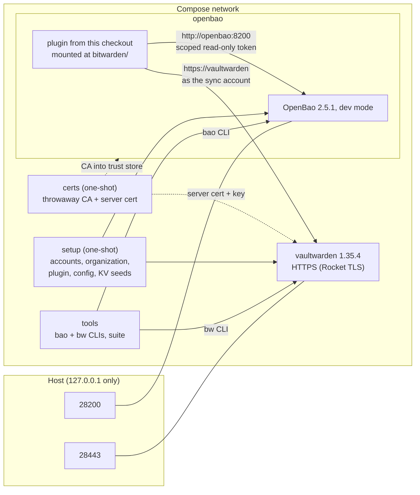

# End-to-end environment

`e2e/` holds a Docker Compose setup that runs the plugin the way an operator
would: built from this checkout, placed in the plugin directory of a real
OpenBao, registered by SHA-256, mounted, and connected over HTTPS to a
Vaultwarden server that has an organization, collections and three accounts.
A tools container carries the `bao` and `bw` CLIs, preconfigured.

Use it to run the automated suite (`mise run e2e-test`) or to try things by hand
(`mise run e2e-up`, `mise run e2e-shell`). It needs Docker with Compose v2 and
[mise](https://mise.jdx.dev) for the tasks, nothing else; the Go build happens
in a container, and `./e2e/run.sh` works without mise.

## What is in it



| Service | Image | Purpose |
|---------|-------|---------|
| `certs` | tools image | One-shot. Creates a CA and a server certificate (`vaultwarden`, `localhost`, `127.0.0.1`), valid 30 days, in named volumes. The CA key is deleted after signing. Nothing is committed |
| `openbao` | `e2e/openbao.Dockerfile`: plugin built with Go 1.27.1 (`CGO_ENABLED=0`), on `openbao/openbao:2.5.1` | Dev-mode server with `plugin_directory` set. Its entrypoint installs the CA with `update-ca-certificates`, because the plugin has no CA option |
| `vaultwarden` | `vaultwarden/server:1.35.4-alpine` | Bitwarden-compatible server with built-in TLS on port 443 |
| `setup` | tools image | One-shot, idempotent. See below |
| `tools` | `e2e/tools.Dockerfile`: Debian with `bao` 2.5.1, `bw` 2026.2.0 (checksum-verified), `jq`, `curl`, `openssl` | Interactive shell and the test suite. Trusts the CA through `NODE_EXTRA_CA_CERTS` (bw) and the system store |

Images are pinned by digest. `certs` and `setup` exit when they are done, so
they have no healthcheck; the services that depend on them wait for exit
code 0. The other services have one.

`setup` (`e2e/scripts/setup.sh`) does what the
[recommended setup](recommended-setup.md) describes:

1. Runs `e2e/bootstrap`, a small Go program (build tag `e2e`) that registers
   the three accounts, creates the organization and two collections as the
   Admin, and invites and confirms the sync account and the Developer. These
   are client-side cryptographic operations in the Bitwarden protocol, which
   a person would do in the web vault.
2. Registers the plugin with `bao plugin register -sha256=...` and mounts it
   at `bitwarden/`.
3. Seeds KV v2 secrets under `secret/shared/` and one under
   `secret/not-synced/`.
4. Creates the policy `bitwarden-e2e-sync-read` (read on
   `secret/data/shared/*`) and a token from it, and writes `bitwarden/config`
   with that token. The plugin never gets the root token.

## Fixture accounts

All credentials are throwaway values defined in one place, the `x-fixtures`
block of `e2e/compose.yaml`. They only work against containers published on
localhost.

| Identity | Email | Master password | In the organization |
|----------|-------|-----------------|---------------------|
| Admin | `admin@e2e.example.com` | `e2e-admin-master-password` | Owner |
| Sync account | `sync-bot@e2e.example.com` | `e2e-sync-master-password` | User, edit access to both collections |
| Developer | `developer@e2e.example.com` | `e2e-developer-master-password` | User, read-only access to both collections |

OpenBao root token: `e2e-root-token`. Organization: `E2E Organization`.
Collections: `OpenBao Synced` (roles sync into it) and `OpenBao Secondary`.

## Start it

```bash
mise run e2e-up       # build, start, run setup; leaves everything running
mise run e2e-shell    # shell in the tools container
mise run e2e-down     # remove containers and volumes
```

`mise run e2e-up` takes about a minute on first build and prints the organization
and collection IDs. Inside the shell, `BAO_ADDR` and `BAO_TOKEN` (root) are
set, `bw` points at the environment's server, and `E2E_ORG_ID`,
`E2E_COLLECTION_ID` and `E2E_COLLECTION_SECONDARY_ID` hold the IDs.

## Walkthrough

In `mise run e2e-shell`:

```bash
# The plugin is healthy and connected.
bao read bitwarden/status
bao read bitwarden/config            # no password, no bao_token

# Map a seeded KV secret to an item in the shared collection and push it.
bao write bitwarden/roles/grafana \
    source_path="secret/data/shared/grafana" \
    cipher_name="Grafana admin" \
    user_field="username" pass_field="password" url_field="url" \
    collection_ids="$E2E_COLLECTION_ID" \
    notes_template="Managed by OpenBao. Edits here are overwritten."
bao write -f bitwarden/sync/grafana
bao read bitwarden/sync/grafana

# Look at it as the Developer, with the Developer's own master password.
export BW_SESSION="$(bw-session.sh developer)"     # or: admin, sync
bw sync
bw get item "Grafana admin"
bw get password "Grafana admin"

# Rotate in OpenBao; the Developer sees the new value.
bao kv patch secret/shared/grafana password="rotated-s3cret"
bao write -f bitwarden/sync/grafana
bw sync
bw get password "Grafana admin"

# As the Admin: organization, collections, members.
export BW_SESSION="$(bw-session.sh admin)"
bw sync
bw list organizations
bw list org-collections --organizationid "$E2E_ORG_ID"
bw list org-members --organizationid "$E2E_ORG_ID"

# Withdraw the secret: the item is deleted.
bao delete bitwarden/roles/grafana
```

`bw-session.sh` logs `bw` in as a fixture account
(`bw login <email> --passwordenv <VAR> --raw`) and prints the session key.
`bw` holds one login at a time.

### From the host

OpenBao is on `http://127.0.0.1:28200` and Vaultwarden on
`https://localhost:28443`.

```bash
docker compose -f e2e/compose.yaml cp openbao:/state/ca.crt ./e2e-ca.crt
curl --cacert ./e2e-ca.crt https://localhost:28443/alive
curl http://127.0.0.1:28200/v1/sys/health

# A host bw, with its own data directory so your real login is untouched:
export BITWARDENCLI_APPDATA_DIR="$PWD/.e2e-bw" NODE_EXTRA_CA_CERTS="$PWD/e2e-ca.crt"
bw config server https://localhost:28443
bw login developer@e2e.example.com
```

A host `bao` works with `BAO_ADDR=http://127.0.0.1:28200` and
`BAO_TOKEN=e2e-root-token`; that was not run here, since the test host has no
`bao` binary.

### Web vault

Open <https://localhost:28443> and log in with one of the fixture accounts
above. The browser warns about the certificate unless you import
`e2e-ca.crt` (see above) as a trusted authority; it is issued for `localhost`
and `127.0.0.1`. Only the HTTP side of this was checked (the page is served
over the published port with a certificate that verifies against the CA). A
login in a real browser was not part of the test.

## The automated suite

```bash
mise run e2e-test            # build, start, run all cases, tear down
KEEP=1 mise run e2e-test     # leave the environment running afterwards
```

`e2e/run.sh` starts from a clean state, runs `setup`, then runs
`e2e/scripts/suite.sh` inside the tools container. Each case drives the
plugin with `bao` and checks the outcome with `bw`, mostly logged in as the
Developer, which also proves the sharing model. It prints `PASS`, `FAIL` or
`KNOWN` per case, exits non-zero on any failure, dumps the container logs on
failure, and always tears down unless `KEEP=1`. A run takes about six
minutes; a minute of that is waiting for a periodic sync.

What it covers:

- plugin registered by SHA-256, mounted and running in OpenBao
- `status`, and `config` never returning `password` or `bao_token`
- TLS: the server certificate verifies against the private CA and not
  without it; the plugin reaches OpenBao over the compose network
- the three identities and their organization roles
- sync into the organization collection: username, password, URI, notes;
  unmapped KV keys as text custom fields; secure notes; sync-all
- rotation with an unchanged item ID; periodic sync without a manual sync
- the Developer cannot edit, delete or add items
- an Admin's manual edit is overwritten by the next sync
- a source path outside the `bao_token` policy is not synced, even for a
  root caller
- `delete sync/:name` and `delete roles/:name`
- a personal-vault mount (no `organization_id`)
- the five scenarios of [way-of-working.md](way-of-working.md), with the
  scoped tokens those playbooks hand out

`KNOWN` cases pin the current behaviour of a defect and fail once it changes:

| Case | Behaviour pinned |
|------|------------------|
| `bao list` on `folders/` | The response has no `keys`, so `bao list -format=json` (2.5.1) prints `{}` and exits 2. The same applies to `collections/`. The API call itself works |
| `collections/:role/assign` | Fails with a 404 from Vaultwarden 1.35.4 for every organization role tried |
| Sync without `bao_token` | Refused with `permission denied`; the caller's token is not usable by the plugin |

## Sync account permissions

`E2E_SYNC_MEMBER_TYPE` (`user`, `manager`, `admin`, `owner`) and
`E2E_SYNC_COLLECTION_ACCESS` (`write`, `manage`, `readonly`, `none`) change
how the sync account is invited. The defaults, `user` and `write`, are the
least privilege that syncing worked with on Vaultwarden 1.35.4. The full
table is in [recommended-setup.md](recommended-setup.md#part-1-admin-in-bitwarden).

```bash
E2E_SYNC_MEMBER_TYPE=admin mise run e2e-up
```

## Settings

| Variable | Default | Meaning |
|----------|---------|---------|
| `E2E_OPENBAO_PORT` | `28200` | Host port of OpenBao, on 127.0.0.1 |
| `E2E_VAULTWARDEN_PORT` | `28443` | Host port of Vaultwarden, on 127.0.0.1 |
| `E2E_SYNC_MEMBER_TYPE` | `user` | Organization role of the sync account |
| `E2E_SYNC_COLLECTION_ACCESS` | `write` | Its access to the collections |
| `E2E_PERIODIC_TIMEOUT` | `240` | Seconds the suite waits for a periodic sync. Set inside the tools container only |
| `KEEP` | `0` | `1`: `e2e/run.sh` does not tear down |

## Limitations

- OpenBao runs in dev mode: in-memory storage, a fixed root token, no seal.
  A restart of the `openbao` container loses the mount; run `mise run e2e-up`
  again (setup is idempotent).
- Vaultwarden only. The official Bitwarden server is not part of this
  environment.
- The accounts, organization and memberships are created through the server
  API by `e2e/bootstrap`, not through the web vault UI. No browser test.
- Removing a member's collection access (offboarding) is not automated.
- The plugin is registered once. The upgrade procedure (new binary,
  re-register, disable/enable) is not exercised.
- The declarative install from an OCI image is not exercised.
- `linux/amd64` was run. The tools image also has an `arm64` branch for the
  Bitwarden CLI download, which was not built here.
- The CI job that runs this suite was added together with the environment
  and has to prove itself on GitHub's runners.
